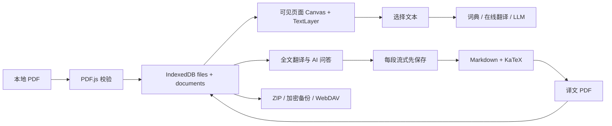

# 项目结构与开发逻辑

适用版本：0.3.0（包含本轮同版本自动保存/启动页修订）。入口为 `index.html` → `src/js/main.js`。这是静态前端工程，**没有 `main.py`，也没有 Python 运行时或后端函数**；与原需求中 main.py 对应的应用协调职责由 `App` 类承担。

## 文件树

```text
pdf_translater/
├─ .codex/pdf_translater_dev.md     用户提供的开发约束（只读）
├─ .gitignore
├─ .prettierrc.json                 新建代码的格式规则
├─ index.html                      唯一页面入口、文件输入、弹窗和提示容器
├─ package.json                    版本、依赖和 npm 命令
├─ package-lock.json               精确依赖锁定
├─ vite.config.js                  相对路径静态构建与本地开发配置
├─ playwright.config.js            Chrome/Chromium 端到端测试配置
├─ LICENSE                         项目 GPL-3.0
├─ README.md                       用户使用说明、部署和能力边界
├─ DEVELOP.md                      结构变动、开发决策、验证记录
├─ CHANGELOG.md                    版本功能及修复
├─ STRUCTURE.md                    本文档
├─ THIRD_PARTY.md                  代码、素材、API 和许可证来源
├─ src/
│  ├─ ui_rules/
│  │  ├─ UI_Design.png              用户提供的主界面参考图
│  │  ├─ ui_design_rules.md         用户提供的设计准则
│  │  └─ reference-preview.jpg      阅读原始大图用的缩小预览，不参与构建
│  ├─ _logo/
│  │  ├─ LUCIDE-LICENSE
│  │  ├─ FLUENT-LICENSE
│  │  ├─ LOBE-ICONS-LICENSE
│  │  ├─ llms/{deepseek,mimo,qwen,openai,glm,kimi,lmstudio}.svg
│  │  ├─ icons/*.svg               62 个已下载 Lucide 图标，清单见下
│  │  └─ art/{open-book,sparkles}.png
│  ├─ js/
│  │  ├─ main.js                   应用协调、标签、工具栏、文档管理
│  │  ├─ storage.js                九表 IndexedDB、事务写入、精确删除合并
│  │  ├─ library.js                文件夹、选择范围、移动、删除计划及 ZIP
│  │  ├─ settings.js               多 API 兼容配置、归一化、默认服务
│  │  ├─ providers.js              八种配置模板、官网映射和浏览器/客户端打开入口
│  │  ├─ document-download.js      一致快照合并编辑，所有 PDF 下载共用
│  │  ├─ utils.js                  转义、UUID、下载、哈希、格式化
│  │  ├─ text.js                   PDF 排版清洗、单词判断、按字节切片
│  │  ├─ translation.js            免费词典、词形补充、基础翻译入口
│  │  ├─ basic-translation.js      非 LLM 服务配置、签名、JSONP、分段和响应解析
│  │  ├─ llm.js                    Chat/Responses、文件输入、SSE、原生 PDF
│  │  ├─ markdown.js               Markdown/KaTeX/高亮/安全 HTML
│  │  ├─ pdf.js                    PDF.js 加载、文本提取、可见页和批注交互
│  │  ├─ pdf-text.js               同源字体、准确尺寸/旋转与字宽/基线对齐
│  │  ├─ pdf-search.js             文本索引、字符位置映射与大小写/全字匹配
│  │  ├─ selection-actions.js      可注册的选区动作、命中状态及局部清除规则
│  │  ├─ shapes.js                 形状选择清单、共享 PDF 点坐标几何及画布路径
│  │  ├─ pdf-export.js             带批注 PDF、视觉版全文译文 PDF
│  │  ├─ archive.js                ZIP、AES、校验、迁移、WebDAV
│  │  └─ ui/
│  │     ├─ components.js          图标、按钮、下拉、弹窗、提示、输入框
│  │     ├─ assistant.js           划词、全文、AI 会话与任务状态
│  │     ├─ library.js             文档管理卡片/列表、多选和操作弹窗
│  │     ├─ pdf-navigation.js      缩略图、内置书签、目标解析及导航渲染生命周期
│  │     ├─ settings-panel.js      设置五页、启动引导、迁移入口
│  │     ├─ basic-settings.js      基础翻译折叠配置、连接测试、默认与保存
│  │     ├─ desktop.js             桌面状态和分栏调整独立交互
│  │     └─ mobile.js              移动端分屏、视口；保留阅读选区供标注
│  └─ styles/
│     ├─ base.css                  Tokens、公共组件、所有功能模块通用样式
│     ├─ pdf-text-layer.css        PDF.js 文字层必要规则及许可证来源注释
│     ├─ desktop.css               >960px 桌面横屏布局
│     └─ mobile.css                ≤960px 移动竖屏布局
├─ public/
│  ├─ fonts/{NotoSansSC-Regular.otf,LICENSE}
│  ├─ pdfjs/{cmaps,standard_fonts,wasm}/   构建前从锁定的 PDF.js 包复制
│  └─ licenses/                    构建时复制项目与素材许可证
├─ tools/
│  ├─ download-assets.ps1          下载开源图标、插画、字体与文档
│  ├─ prepare-assets.mjs           拷贝 PDF.js 资源和分发许可证
│  ├─ check.mjs                    递归进行 JavaScript 语法检查
│  └─ verify-dist.mjs              生产子路径静态部署、无 CDN、中文导出检查
├─ tests/
│  ├─ core.test.mjs                数据、清洗、SSE 和存档协议测试
│  ├─ providers.test.mjs           模板、可信官网映射、原配置保留与原生桥接测试
│  ├─ basic-translation.test.mjs   三家签名、响应、分段/取消、凭据存档和并发保存
│  ├─ settings-persistence.test.mjs 自动保存交错写入、完整设置备份、清空 API 防复活
│  ├─ selection-actions.test.mjs   选区规则、多类型/多页与局部清除测试
│  ├─ save-file.test.mjs           单次保存、取消和写失败不重复下载测试
│  ├─ shapes.test.mjs              形状几何、删除线及字号规则测试
│  ├─ search-geometry.test.mjs     搜索过滤、跨文本片段、移动边界与命中测试
│  ├─ library.test.mjs             目录/删除边界、事务回滚、共享历史、ZIP 和冲突测试
│  └─ e2e/
│     ├─ app.spec.js               原有合成 PDF 的真实浏览器功能回归
│     ├─ optimizations.spec.js     状态反馈、松手翻译、绘图尺寸和导航回归
│     ├─ reader-refinements.spec.js 字形坐标、旋转/裁切、高 DPI、拖动/历史及搜索浮窗
│     ├─ library.spec.js           文档库交互、共享历史、下载、切换锁和无损升级
│     ├─ editing-settings.spec.js  编辑导出回读、选词/绘图手势、引导/API 设置回归
│     ├─ basic-translation.spec.js 基础设置/教程/默认引擎、JSONP 和阅读区路由
│     └─ settings-autosave.spec.js 自动保存、即时备份、动画速度、桌面/手机启动页
├─ dist/                           构建产物，不手工编辑
├─ node_modules/                   npm 依赖，不手工编辑
├─ .cache/                         npm 缓存、开发期官方文档，不进入发布
└─ test-results/                   测试截图、失败 trace，不属于用户数据
```

图标文件名（均为 `.svg`）：`arrow-left`、`arrow-up-right`、`book-open`、`bot`、`check`、`chevron-down`、`chevron-left`、`chevron-right`、`circle-alert`、`circle-help`、`cloud`、`copy`、`database`、`download`、`eraser`、`expand`、`external-link`、`eye`、`file-text`、`folder-open`、`highlighter`、`history`、`key-round`、`languages`、`loader-circle`、`menu`、`message-square`、`minus`、`monitor`、`panel-left-close`、`pencil`、`plus`、`redo-2`、`refresh-cw`、`search`、`send`、`settings-2`、`shield-check`、`smartphone`、`sparkles`、`stop-circle`、`trash-2`、`type`、`underline`、`undo-2`、`upload`、`volume-2`、`x`。

`public/pdfjs` 内的文件清单由 `node_modules/pdfjs-dist/{cmaps,standard_fonts,wasm}` 与 package-lock 唯一决定，属于供应商静态数据而非应用模块；构建无 CDN 依赖。

0.1.2 追加的六个图标文件：`strikethrough.svg`、`shapes.svg`、`rectangle-horizontal.svg`、`circle.svg`、`gallery-vertical-end.svg`、`bookmark.svg`。直线、箭头和转换进度复用已有 minus、arrow-up-right、loader-circle 图标。

0.2.0 追加：`folder-plus.svg`、`folder-input.svg`、`layout-grid.svg`、`list.svg`、`arrow-up.svg`、`arrow-down.svg`、`folder-tree.svg`（Lucide 0.468.0）。

0.2.1 追加 `eye-off.svg`（Lucide 0.468.0）和七个厂商 LOGO（Lobe Icons 固定提交，下载出处见 THIRD_PARTY.md）。

## 数据模型与不变量

数据库名 `paper-bridge`，版本 2；所有对象仓库以 `id` 为 keyPath。升级仅新增缺失表，旧文档 folderId 缺省视为根目录，不重写或清除原数据。

| 表 | 核心字段 | 用途 / 不变量 |
| --- | --- | --- |
| documents | id, rootId, folderId?, name, pages, size, page, zoom, createdAt, updatedAt, translationId? | folderId 为空代表根目录；rootId 是稳定逻辑组 ID，原文删除后仍保留该值以继续共享历史 |
| files | id, blob, updatedAt | id 与 documents 一致；原始或生成 PDF 不可变，避免编辑破坏源文件 |
| annotations | id, documentId, page, type, color, rects/points/x/y/text, selectedText?, fontSize?, strokeWidth?, shape?/start?/end?, deleted, recovered? | 下划线/删除线/高亮/新批注保存选区 rects；笔迹 points 与形状 start/end 使用归一化坐标；尺寸以 pt 保存；局部移除裁剪 rects，清空使用 tombstone |
| conversations | id, rootId, title, createdAt, updatedAt | 逻辑文档下多条独立会话；原文和译文共享 |
| messages | id, conversationId, role, content, status, error?, createdAt, updatedAt, recovered? | 用户先保存再请求；助手逐增量保存；不按轮数裁剪 |
| translations | id, documentId, rootId, content, language, providerId, status, error?, output, generatedDocumentId? | 多次全文翻译记录及 PDF 产物关联 |
| settings | id, value, updatedAt | `app` 存 LLM/API、basicTranslation、翻译/WebDAV、hideOnboarding；`workspace` 存标签/当前对话；`annotation-tools` 存工具偏好；`library-view` 存当前目录、卡片/列表及排序 |
| folders | id, parentId, name, createdAt, updatedAt | parentId 为空表示根目录，禁止自引用和循环，不以显示名称确定操作范围 |
| deletions | id, store, key, documentId?/rootId?/conversationId?, updatedAt | 精确删除标记，id=`store-key`；只记录已删实体 ID 和所有者，不保存文件内容，不递归推导额外删除 |

`status` 常见值：`streaming`、`complete`、`stopped`、`error`；从旧会话恢复的未完成 streaming 内容如实显示未完成，不在启动时批量篡改状态（避免影响另一个仍活动的窗口）。

所有恢复冲突副本 ID 为 `原ID-recovery-更新时间`，相同旧版本只保留一次。批注副本也保留在数据库和页面，可通过撤销/编辑处理，不会丢掉已有内容。文件 Blob 不随 metadata 合并被覆盖。

## 内部模块 API / 函数

### storage.js

- `database()`：懒打开数据库，只在 upgrade 创建缺失结构；升级被其他窗口阻挡时发出事件。
- `all(store)`、`get(store,id)`：读取记录。
- `put(store,row)`：克隆、更新时间并等待事务；检查删除标记和批注/译文/会话/消息所有者仍存在，防止已删除内容被异步任务回填。
- `patch(store,id,values)`：在同一事务里读取再合并，避免覆盖无关字段。
- `addDocument(blob,name,pages,rootId?,folderId?,sourceId?)`：metadata/Blob 同事务写入；目标目录必须存在，生成译文时从 sourceId 的最新记录继承逻辑组与原文目录，来源已删除则拒绝创建。
- `snapshot()`：单个只读事务得到所有表的一致快照。
- `mergeSnapshot(data,{restoreSettings,restoreDeleted})`：跨表原子合并，保留冲突内容，合并目录/精确删除标记；被动同步不复活已删除对象。主动本地导入可移除对应标记并用晚于删除的时间恢复记录。
- `contextDocument(rootId,preferredId)`：优先原文，原文已删则选择当前或其他存活组成员，用于继续 AI 上下文。
- `applyExactDeletions(tx)`（内部）：仅处理标记中准确的键和所有者；较新本地编辑阻止陈旧删除，仍存活组的数据保留；移除被拒绝的删除标记；修复缺失父目录和合并循环为根目录，不删除其中内容。
- `requestPersistence()`：请求浏览器持久存储，返回实际授权结果，不承诺浏览器不会被主动清空。

### library.js

- `objectKey(kind,id)`：区分文档/文件夹选择键，避免跨类型 ID 混用。
- `readLibrary()`：同一只读事务获取目录和文档的一致列表。
- `validateFolderTree(folders)`：检查父目录存在和循环；不合法时中止操作。
- `expandSelection(state,keys)`：仅展开明确选中文件夹的后代及明确选中文档，使用集合去重；不按 rootId 扩大下载/删除集合。
- `sortLibraryObjects(objects,sort,direction)`：文件夹优先，组内按名称自然排序或 createdAt 正/倒序。
- `createFolder(name,parentId)`：校验名称、父目录及同级同名冲突，再保存。
- `moveSelection(keys,destination)`：单事务移动顶级选择、保持后代层级；阻止移入自己/后代；原文移动时其译文跟随原文目标目录，单独移动译文不反向移动原文。
- `planDeletion(state,keys)`：生成要审核的文档/文件夹 ID、名称和完整显示路径清单。
- `deleteSelection(plan)`：确认清单与执行时有效选区取交集，绝不纳入新后代；精确删 metadata/Blob/批注，仅无存活组成员时删共享会话、消息和全文历史；仍有成员则重绑必要引用；空目录逐层移除，非空目录保留；一个事务提交并写删除标记。
- `downloadPlan(state,keys)`：选中文件夹包含自身/所有后代/空目录，文件不会隐式携带配对文档；超过两 PDF 或含文件夹则 ZIP；安全路径与重名序号防止丢文件。
- `buildLibraryZip(plan)`：按计划逐份调用 editedDocumentBlob 合并当前编辑后生成 ZIP；任一文件缺失或导出失败则报错，不静默改用原始文件或漏掉内容。

### settings.js

- `PROVIDERS`：从 providers.js 兼容重导出，供启动引导与“添加”菜单复用。
- `normalizeSettings(raw)`：兼容海姆休息室单 API 和多 API 格式；规范化 URL、去重 provider ID、同步默认三字段。
- `translationProviderId`：划词/句子翻译专用 API 偏好；旧数据缺省取默认 API，不修改 `defaultChatProviderId`。
- `getSettings()`、`reloadSettings()`：读取/重载配置缓存。
- `saveSettings(nextOrUpdater)`：所有设置共用串行队列；对象入队时深拷贝，函数按执行时最新配置计算补丁，避免 LLM/基础/引导等交错写入丢字段；提交存储后更新缓存、派发 settings-changed。失败不阻断之后重试。
- `flushSettings()`：返回当前保存队列完成 Promise；备份在 snapshot 前等待它，避免漏掉最后一笔自动保存。
- normalizeSettings 将显式 chatProviders=[] 视为清空；仅字段不存在时兼容旧单 API，避免删除最后一项后被旧 baseUrl/apiKey 别名重新创建。
- `saveBasicTranslation(update,preferences?)`：委托全局设置队列读取最新 basicTranslation 后合并单项凭据/默认值，避免多家配置并发保存互相覆盖；阅读区基础引擎选择复用此入口，可同时保存风格等偏好。
- `getProvider(settings,id?)`：选择 API，缺少地址或模型时给出明确错误。

### providers.js / document-download.js

- `PROVIDERS`：DeepSeek、MiMO、Qwen、OpenAI、GLM、Kimi、LM Studio、自定义八个模板；名称、Base URL、model 按用户指定值，官网 keyUrl 仅供固定链接映射；模板不应用于已有配置。具体值见 README。
- `providerKeyUrl(baseUrl)`：读取当前输入，按完整主机名匹配已知服务；拒绝无效协议、内嵌凭据、自定义端口和仿冒后缀域名，返回固定官网 URL 或 null，绝不携带输入的查询参数/Key。
- `openExternalWebsite(url)`：只允许不带内嵌凭据的 HTTPS 链接，供已知官网及基础服务教程复用网页/Tauri 打开逻辑。
- `openProviderWebsite(baseUrl)`：映射固定官网后委托 openExternalWebsite；网页通过 noopener/noreferrer 打开新标签；Tauri 2 使用 opener.openUrl 或 plugin:opener|open_url，Tauri 1 使用 shell.open，唤起默认浏览器。打包需启用插件权限，仓库不包含原生安装包。
- `editedDocumentBlob(documentId)`：readonly 事务读取 documents/files/annotations 的同一快照；仅合并所属文档未删除记录。没有编辑直接返回原 Blob，有编辑按需加载 PDF.js/pdf-lib 并复用 exportAnnotatedPdf，finally 释放独立源解析器；不覆盖数据库文件、不依赖随标签切换销毁的阅读器实例。阅读栏、文档管理所有下载模式、已生成译文下载均复用。
- `hideOnboarding`：默认 false，只有显式开关设置为 true 才跳过引导；onboardingDone 保留兼容字段但不再控制弹出。切换开关立即保存，跳过/完成前等待保存，随既有设置备份流程持久化。

### basic-translation.js

- `BASIC_APIS` / `BASIC_FREE`：固定三家需凭据的服务元数据、字段标签与额度文案，以及 MyMemory/Google 两个免 Key 选项。
- `basicConfigured` / `basicOptions`：判断凭据完整度；只将完整配置加入选择器。
- `normalizeBasicTranslation`：规范化 `{defaultProvider,providers:{baidu,aliyun,volcengine}}`；每家为 `{keyId,secret,connection?}`。connection 仅保存成功状态、checkedAt 和测试风格，不保存测试文本或译文；旧设置缺省 MyMemory。
- `mergeBasicTranslation(local,incoming)`：存档恢复时保留缺失的本地凭据；无密钥的不同账号不覆盖现有完整账号；不混用账号 ID 和另一账号的密钥。
- `basicLanguage(provider,language)`：应用语言码映射到各服务语言码；Baidu academic 限中英，Google 保留标准代码。
- `buildBasicRequest(provider,config,text,source,target,style,{date,nonce})`：生成官方端点的完整请求；百度 MD5(appid+q+salt+[domain]+secret)，阿里 RPC POST HMAC-SHA1，火山 V4 HMAC-SHA256，region=cn-north-1/service=translate；从不手动设置浏览器禁止的 Host，只将域名纳入签名。
- `baiduJsonp(url,signal)`：仅允许固定官方 origin 及两个翻译路径；随机一次性 callback、无 Referrer，完成/错误/超时/取消时移除 script 与回调。
- `parseBasicResponse(provider,json)`：解析五种响应、多条译文、服务错误码；拒绝空结果/无效结构，不误标成功，不把原始密钥反射到错误文案。
- `sendBasicRequest`（内部）：fetch/JSONP、20 秒单次超时；百度在当前页面按全局队列维持至少 1050ms 请求间隔，支持取消等待。不会将选中文字发往未选服务或 LLM。
- `basicTranslate(text,options)`：清理 PDF 文本后按 UTF-8 字节分段完整翻译；MyMemory 450，Google/百度 GET 1500，阿里/火山 POST 4500 字节，保留全部段；清理与同语种处理沿用现有功能。
- `digest` / `hmac` / `encode` / `query` / `hex` / `bytes`：浏览器 Web Crypto、RFC3986 编码和签名序列化；MD5 按需加载已锁定的 @noble/hashes/legacy.js。

### text.js / translation.js

- `cleanPdfText(input)`：检测连续行号、修复断行连字、过滤数字引用、合并空白；保留公式上标与年份。
- `isSingleWord(text)`：英文单词（可含连字或撇号）走词典，其余走句子翻译。
- `splitForTranslation(text,byteLimit=450)`：按 Unicode 码点切片，以 UTF-8 字节限制请求，不破坏代理对。
- `CLEANING_INSTRUCTIONS`：统一 LLM 排版修复和文档内指令隔离提示。
- `onlineTranslate(text,source,target,signal,basic,style)`：按 basic.defaultProvider 委托 basicTranslate，缺省 MyMemory，保留超时/取消；lookupWord 的中文补充使用同一基础配置及通用风格。
- `lookupWord(word,signal,onUpdate,basic)`：Free Dictionary/Wiktionary REST 英文定义并行竞速，中文与词形独立并行；增量回调显示先到结果，单源超时不阻断其他来源。仅中文可用时说明缺少详细词典，不查询 LLM。
- `dictionaryJson(url,signal)` / `plainText(html)`（内部）：6.5 秒独立词典超时，提取词条 HTML 的纯文字。
- `LANGUAGES`：中简/中繁/英/日/韩/法/德/西的展示和 API 代码映射。

### llm.js

- `headers(provider)`：按服务组装 JSON 与 Key 头，兼容 MiMo `api-key`。
- `sseEvents(body)`：流式 UTF-8 解码；支持分块 CRLF、多行 data、尾包，释放 reader 锁。
- `extractText(json)`：Chat 与 Responses 非流式文本统一提取。
- `requestLlm(options)`：构造协议请求，可附整份 PDF；处理 Markdown 增量、完成标记、错误、截断与原生 PDF 容器文件。`onDelta` 是异步回调，必须 await 持久化。
- Chat 兼容文件回退：只在 400 且错误匹配 `file must have a file_id or file_data` 时，从 `file: {filename,file_data}` 改为文件部分的顶层字段后重试一次。文件数据、完整历史、服务地址和凭据保持一致；不扩大到其他错误或自动截断/降级。
- `testProvider(provider,signal)`：短文本响应测试，不设置可能破坏结构的输出截断。
- `listModels(provider)`：读取 `/models`，超时后报告错误。

### markdown.js / pdf-export.js

- `renderMarkdown(text)`：Markdown + KaTeX + 代码高亮后 DOMPurify 清理，允许所需的安全字体、颜色、表格样式。
- `mountMarkdown(element,text)`：将安全内容放入容器，链接隔离打开；远程图片改占位，避免隐式请求。
- `loadFont()`（内部）：第一次含文本的批注导出加载 Noto 字体。
- `exportAnnotatedPdf(blob,annotations,sourcePdf)`：读取原 PDF，按 viewport 转换归一化坐标，绘制高亮、下划线、删除线、指定笔宽笔迹及形状矢量轮廓，中英文字使用记录的 fontSize；保持原文件不变。
- `markdownToPdf(text,onProgress)`：离屏渲染译文，逐块/逐页生成 PDF；过高块分片，逐页释放画布。输出为栅格视觉 PDF。

### pdf.js

- `loadPdf(blob,onPassword)`：传入本地二进制及本地 CMap/字体/WASM；密码通过回调获取；为 PDF.js 6 的 loading task 提供统一 destroy 适配。
- `extractPdfText(pdf,onProgress)`：顺序获取每页文字，按位置移除页边纯数字行号，附页码。
- `PdfViewer.constructor`：绑定 Pointer/Touch 按下、松开、取消和键盘释放；仅跟踪 PDF 选择手势，selectionchange 只更新选区状态。文档外松手也可完成从 PDF 开始的选择，多触点未全部离开时不翻译。
- `queueSelectionTranslation(delay)`：无活动指针/触控时才提交；鼠标松开立即提交，触控结束延迟 60ms 等待原生选区稳定，同一完成选区去重。
- `setDrawingOptions(options)`：同步后续批注/文本框字号、手绘笔宽和形状类型；绘制开始时冻结参数，不修改已有记录。
- `open(doc,pdf)`：取消旧渲染、切换文档和批注。
- `layout()`：计算比例、建立页面占位、观察可见页、记录滚动页码和已布局宽度/DPR。主入口仅在尺寸或 DPR 变化时请求 fit 重排，避免延迟清空选区。
- `renderPage(number,generation)`：返回或复用该页完整绘制 Promise，供可见页加载与搜索/历史精确定位等待文字层就绪。
- `paintPage(number,generation)`：建立画布/文字/批注/搜索/手绘层，防止旧任务回填；延续原超采样与 600 万像素预算。调用 renderAlignedText 保持字体、尺寸、裁切/旋转/UserUnit 一致；加载后重绘搜索标记。
- `goTo(page)`、`setZoom(zoom)`：页码边界、滚动和重新布局。
- `goToLocation(page,rect)`：先等待页面就绪，再按归一化位置滚动纵/横轴并更新页码。
- `getPageContent(number)`：按当前 PDF 缓存文本提取 Promise，切换文档清除。
- `search(query,options,{signal,onProgress})`：逐页收集全部匹配，支持取消及页数进度；结果仅在内存，空查询清除高亮。
- `matchRects(match)`：按 itemIndex/字符范围创建真实 DOM Range，返回匹配文字的归一化矩形。
- `drawSearchMatches(page)` / `revealSearchMatch(match)`：绘制独立浅黄标记；点击结果定位实际文字而非只跳到页首。
- `setTool(tool,color)`：切换鼠标命中层；文本框/手绘/橡皮擦/形状使用 Canvas 命中层，选择工具保留文字选择。
- `captureSelection({translate=false})`：裁切 Range 与文字 span 的交集，转换归一化坐标，刷新按钮状态；仅明确 translate=true、没有按住的指针且内容未提交过时调用翻译回调。
- `clearSelection(clearNative)`：清空选区与按下状态，按需释放浏览器选区。
- `applySelectionAction(type,color)`：按注册规则添加或局部清除；空选区不执行，互斥防重复，完成后释放；批注输入取消不创建记录。
- `commitAnnotationChanges(rows)`：一次 annotations 事务提交同一操作的所有页面；提交成功再更新当前文档和绘制。
- `addAnnotation(value)`：先保存后绘制，记录当前文档撤销栈。
- `historyState()` / `notifyHistory()`：返回当前文档 undo/redo 可用性；空栈或提交中禁用按钮。
- `annotationLocation(annotation)`：便签/文本框取自身位置，其他标记取选区/笔迹/形状位置。
- `undo(redo)`：提交对应 before/after 或 tombstone，然后定位操作页及位置。失败恢复栈；历史仍仅本次会话有效。
- 选区动作历史为 `{changes:[{before,after}],location?}`，保留局部清除真实位置；拖动和编辑使用 before/after，兼容原笔迹创建的历史格式。
- `editAnnotation(annotation)`：文本或便签编辑/删除回调，纳入历史。
- `startAnnotationDrag(event,page)`：选词手势期间或形状菜单首笔转发时不介入；其他情况下命中便签/文本框/形状后由页面捕获指针；3px 内仍视为点击编辑，超过阈值预览位移，松手事务提交、取消恢复。`cancelAnnotationDrag` 清理手势、监听和捕获。
- `drawAnnotations(page)`：重绘标记和带 touch-action 的透明形状命中区域；字体/笔宽继续按已有数据绘制。
- `releaseTextSelection()`：指针和触控均已释放时移除 selecting-text；取词期间通过此类关闭所有覆盖元素 pointer-events，取消/窗口失焦也清理。
- `beginShapeFromPointer(event)`：菜单在窗口 pointerdown 捕获阶段关闭并激活后，若原目标尚非墨迹层，转发首次按下到同页画布，保留首笔鼠标/触控绘制。
- `bindInk(canvas,page)`：原手绘/形状创建保留；橡皮擦按笔迹线段或形状几何命中并删除整个对象，纳入历史。

### pdf-text.js / pdf-search.js

- `renderAlignedText(page,content,container,viewport)`：从 PDF.js 已加载字体取得同源字体/字重/斜体，统一文档语言；保留官方 TextLayer 并校正实际 DOM 字宽、精确位置和基线，显式设置未旋转页面尺寸并应用旋转 CSS。返回文字段与 itemIndex→span 映射供搜索定位。
- `indexPageText(items)`：生成搜索字符串与每个原始文本片段的范围；换行和有间距片段间插空白，保留字符索引映射。
- `findPageMatches(index,query,{caseSensitive,wholeWord})`：转义查询中的正则字符，支持空白跨片段、大小写及 Unicode 词边界，返回全部匹配范围、parts 和单行摘要。

### selection-actions.js

- `registerSelectionAction(type,create)`：注册创建回调；返回额外字段，或返回 `null` 取消。当前注册 underline/strike/highlight/note，note 从 context 读取 fontSize。未来同类工具注册后可复用状态、删除和执行逻辑。
- `isSelectionAction(type)`：区分一次性选区动作与手绘/文本框持续模式。
- `overlaps(a,b)`：同页且水平相交、同一文字行的垂直重合判定。
- `subtractSelection(rects,selection)`：从已有标记矩形扣除选中文字对应部分，保留左右未选部分。
- `matchingAnnotations(type,annotations,selection)`：按类型和选区查找未删除标记。
- `selectionActionState(annotations,selection)`：返回所有注册工具的独立按下状态，可同时为 true。
- `planSelectionAction(type,annotations,selection,context)`：无选区空操作；有命中则生成局部移除计划；无命中调用 create 按页生成记录。纯规则不读写数据库，由 PdfViewer 统一提交。

旧版没有 rects 的自由便签仍保留原位、可点击编辑，不猜测其文本关联，也不迁移或清除旧记录。

### shapes.js

- `SHAPES`：rectangle/circle/line/arrow 的值、下载图标名、中文标签映射。
- `shapeGeometry(annotation,width,height)`：将归一化 start/end 转为 PDF pt；矩形允许反向拖动，圆形按短边保持正圆，箭头返回主线和两条箭头边。
- `drawShape(context,annotation,width,height)`：绘制 Canvas 路径；PDF 导出复用 shapeGeometry 生成矢量指令，保持几何一致。
- `distanceToSegment(point,start,end)`：命中笔迹/线形状，覆盖采样点之间的笔段。
- `hitShape(annotation,point,width,height,tolerance)`：矩形/圆内及直线/箭头附近命中，供拖动与橡皮擦复用。
- `translateAnnotation(annotation,dx,dy,box)`：在页面边界内平移自身坐标；便签原文 rects 锚点保留，形状尺寸不变。

### archive.js

- `createArchive({includeSecrets,password})`：先等待 flushSettings，再创建一致快照、二进制 PDF、SHA-256 清单、异步 ZIP；格式版本 2 包含九表及目录/删除记录，可剥除凭据和加密。includeSecrets=false 时也清空全部基础翻译 keyId/secret/连接状态；现有云同步同样不携带它们。
- `keyFor`、`encrypt`、`decrypt`（内部）：PBKDF2-SHA256 250000 次，AES-256-GCM；magic `PBRIDGE1` + 16 字节 salt + 12 字节 IV + 密文。
- `readArchive(blob,password)`：接受格式 1/2，旧版新表补空；验证层级、删除记录所有者、逻辑组根锚点、跨表引用、文件哈希和 PDF 头，全部通过才允许合并。
- 0.1.2 批注校验新增 strike、shape，校验形状枚举、起止点和可选字号/笔宽；兼容旧记录缺省字段。存档和数据库版本不变，新增记录应使用 0.1.2 或更新版本恢复。
- `importArchive(blob,options)`：验证后事务合并；显式本地导入启用 restoreDeleted 恢复备份中存在的已删对象，可恢复设置并刷新缓存；被动云合并不启用此选项。
- `importFritiaSettings(file)`：从 JSON 或原项目 ZIP 中查找旧设置字段，合并 provider，不修改来源文件。
- `auth`、`remoteUrl`、`dav`（内部）：UTF-8 Basic Auth、安全 HTTP(S) 路径与超时请求。
- `testWebDav(config)`：PROPFIND 检查实际浏览器跨域请求。
- `syncWebDav(onStatus)`：禁止重入；GET+校验+本地合并+条件 PUT；不暴露凭据到云端，无强 ETag 时拒绝覆盖已有数据。
- `scheduleSync(onStatus,onError)`：按保存的启用状态设置 30 分钟定时器（最小间隔 5 分钟）。

### utils.js

`uid` 创建 UUID；`esc` 转义 HTML；`sizeLabel`、`dateLabel` 格式化展示；`download` 创建下载链接并延迟释放 Blob URL；`sha256` 算文件摘要；`bytesToBase64` 分块编码；`safeUrl` 只允许 HTTP(S) 且拒绝 URL 中嵌凭据；`errorMessage` 转换取消/超时/网络/接口异常。

- `chooseSaveTarget(filename,{directory})`：由点击处理同步进入原生选址，返回文件/目录句柄或取消 null；API 缺失/NotSupportedError 返回 defaultDownload 标记，不额外提示。SecurityError 不伪装成不支持，不静默重复下载。
- `saveFile(blob,filename,{target})`：校验非空 Blob，写入已获取的句柄，或按 defaultDownload 下载到默认位置；没有预选目标时可获取一次。取消不下载，写失败 abort 并抛错，不重新选择或下载。

### ui/library.js 的 LibraryView

- `constructor/open/persist`：初始化目录、选择集合和视图/排序偏好，读取一致库状态，修复已不存在的当前目录为根目录；偏好保存在 settings/library-view。
- `breadcrumbs`：以父 ID 链构建路径，防止循环。
- `render/renderObjects/updateSelection`：页面骨架、文件夹优先的卡片/列表、左上选择框及批量按钮；切换目录/搜索清空选择，排序/视图切换保留选中 ID。
- `action`：分发新建、视图、排序、移动、下载和删除。
- `rename`：沿用文档重命名，并支持文件夹命名。
- `move`：展示根目录和内部文件树，屏蔽选中文件夹及其后代作为目标；在当前目标内新建子目录，确认后调用 moveSelection。
- `remove`：生成并展示删除对象路径清单；确认后等待受影响任务退出，执行精确事务，再协调工作区和重绘。
- `download`：从缓存库状态立即生成选择计划并选址；单文件直接存、两文件共用目录、超过两文件/含目录用 ZIP；无选择器默认下载。保存目录内遇同名文件采用新序号，每份文件经 editedDocumentBlob 合并编辑。

### ui/components.js

`icon` / `illustration` 读取构建时导入的本地图标/插画；`button` / `iconButton` 生成有 aria-label 的按钮；`select` / `selected` / `bindSelects` 实现自绘下拉与键盘选择；`closeMenus` 统一关闭；`toast` 展示临时状态；`modal` 管理焦点环、Esc 和遮罩；`inputDialog` 返回可等待的文本、密码、取消或删除操作。

`anchoredPopover(anchor,title,body)` 复用 modal 焦点和关闭机制，将浮层固定在按钮下方 8px；限制视口宽高、窗口变化时重定位、关闭后移除监听。只用于翻译设置，不改变其他设置弹窗布局。

### ui/basic-settings.js

- `BasicSettings`：render 生成标题、默认模型、三个默认折叠栏目与教程；section 定位配置，capture 读取表单输入，bindDefault/updateDefault 绑定自绘下拉并只列出已保存完整配置。
- `status`：未配置/未测试/测试中/可连接/连接失败，成功为绿点，tooltip 提供测试时间及百度风格。
- `test`：短句 en→zh-CN 按当前风格验证，按钮旋转等待；凭据变化递增 revision 并 abort，过期成功不覆盖当前状态；输入实时保存账号，测试完成后静默保存有效状态/时间。
- `save(id,silent=false)`：输入/change 和测试状态变化调用 silent=true，按 lastQueued 签名去重、捕获当前不可变值并入队，不弹成功提示；手动保存仍反馈成功。仅选项发生变化才重绘默认选择器，保持用户正在操作的下拉状态。
- `destroy`：捕获并静默保存最后输入，取消全部在途测试，设置 destroyed 标记防止旧回调更新新页面，返回当前写入完成 Promise。
- 教程链接委托 openExternalWebsite，新标签或宿主系统浏览器；密钥眼睛按钮仅切换 input.type。

### ui/settings-panel.js

- `providerMenu()`：复用 custom-select 的自绘服务商菜单、逐行厂商 LOGO，选择后 capture 现有草稿再追加新配置。
- `openSettings(app,tab)`：API、基础翻译、备份、WebDAV、帮助五视图；新增、填写、选择协议/能力/默认、移除均自动持久化；眼睛按钮仅切换输入类型，获取按钮监听当前 URL 输入并在点击时重读；测试不覆盖设置。
- `persistApi` / `autoSaveApi`（openSettings 内部）：capture 从当前表单自身读取协议和字段，使用 apiSnapshot 去重并调用串行 saveSettings；同步配置卡片名称，不重绘输入框。切换子页、配置及关闭窗口均捕获最后输入，自动保存只在失败时报告。
- `saveApi(close)`：顶部“保存当前设置”传 false，底部“保存设置”传 true，均等待真实落盘，前者保持窗口。
- `onboarding(app)`：hideOnboarding 为 false 时显示欢迎→服务商→配置流程，主标题为“纸间 · 文献翻译 & AI 分析”，作者链接通过 openExternalWebsite 打开；“直接进入 APP”与配置按钮居中，偏好开关右下角，新增右上角关闭按钮。关闭本次引导不等于不再显示，只有显式开关控制后续弹出。

### ui/assistant.js 的 Assistant

- `constructor` / `render`：绑定右栏标签，按渲染 epoch 防止旧异步视图覆盖新视图。
- `renderSelection` / `translateSelection`：内存缓存按文档分组；新选区取消旧请求；单词与句子严格分流。
- `settings`：按钮下方的紧凑引擎、源/目标语言、学术风格浮层；引擎逐行列出全部可用基础翻译和已配置 LLM，保存专用 API 选择。
- `renderFull` / `startFull`：全文参数、历史、按文档分组的独立任务、流式落盘和阶段反馈。
- `setFullCollapsed(documentId,collapsed)`：首段译文保存后动画折叠参数；更新可展开的 sticky 进度栏，折叠内容 inert 防止焦点进入；手动展开不会在后续流式增量中重新折叠。
- `exportTranslation`：按译文记录互斥，复用或新建译文 PDF；写入关联根 ID；打开或经 editedDocumentBlob 合并译文编辑后下载。全文请求直接返回 PDF 时不重复进入本地转换分支。
- `renderChat` / `appendMessage`：按 rootId / conversationId 加载消息，显示部分结果和恢复副本。
- `appendMessage` 对仍有活动任务且尚无内容的助手消息显示“正在思考”环；onDelta 替换为内容，失败/停止后按最终状态渲染。
- `updateExportProgress()`：按 result-toolbar 的 translationId 读取转换互斥集合，设置打开/下载按钮的旋转图标、aria-busy 和禁用状态；转换的 try/finally 及历史切换均同步调用。
- `createThread`：创建独立会话并保存当前会话选择。
- `sendMessage`：先保存提问与回复占位，再组织完整文档及全部历史；每段流式先 patch，再更新当前匹配面板。
- `stopForDeletion(plan)`：中止选中 PDF 的全文任务，以及无存活组成员的聊天任务，并等待完成信号；保留其他文档/组任务。
- 原文物理记录删除后，问答通过 contextDocument 使用存活文件，完整历史仍按稳定 rootId 关联。下载结果时复用预选句柄，避免首次冷加载丢失用户点击授权。
- `needsDocument`、`copy`、`speak`：空态、剪贴板、系统语音朗读辅助。

### main.js 的 App（主入口职责）

| 方法 | 功能 |
| --- | --- |
| constructor / init | 初始化状态、数据库、界面、持久存储请求、恢复标签/对话和首次引导 |
| mount / bind / action | 生成静态界面骨架、委托动作、导入拖放、快捷键、尺寸变化 |
| importFiles | 逐份校验加载 PDF，事务保存后打开；失败不产生半成品 |
| importGenerated | 验证生成的 PDF，保存为共享原文 rootId 的新文档 |
| openDocument / performOpenDocument / closeDocument | 进行中 Promise 锁定第一次切换，后续点击不打断；加载后复查存在性，关闭只移除标签 |
| saveWorkspace | 保存标签、活动 PDF 和每个文档活动对话 |
| renderTabs / renderToolbar / toolButton | 单行文件卡片、指定顺序的工具条、颜色和激活反馈 |
| updateToolButtons | 依据选区规则同步多个按钮按下状态，不重建工具栏或打断选区 |
| updateHistoryButtons | 根据阅读器历史状态同步撤销/重做按钮禁用状态 |
| setTool / colorPicker / saveToolOptions | 选区动作或持续工具分发，颜色/形状与 pt 滑块浮层，保存后续工具偏好 |
| changeZoom / setPage | 比例、跳页和延迟保存滚动位置 |
| showReader / showSecondary | 工作区与管理页之间切换 |
| showLibrary / showRecords | 委托 LibraryView 展示文件库；单独展示全文历史 |
| documentText | 顺序提取全文，缓存最近一份文本并释放临时 PDF Worker |
| downloadCurrent | 点击后先选址，再读 Blob/懒加载导出模块；保存互斥，每次操作只保存一次 |
| reload / refreshAssistant | 导入、设置、云同步后的界面刷新 |
| prepareLibraryDeletion / afterLibraryDeletion | 等待文件切换和受影响生成任务；删除后清理已删对象的标签/缓存及失效工作区引用 |
| updateSaved / setSyncStatus | 持久化提交及同步状态展示 |

### ui/pdf-navigation.js 的 PdfNavigation

- `constructor(root,{navigate,onMode,error,search,navigateMatch})`：模式为 bookmarks/thumbnails/search/关闭，持有当前文档搜索条件及临时结果。
- `stopRendering()`：增加世代号、断开观察器、取消临时缩略图任务。
- `setDocument(pdf)`：切换来源、取消旧搜索并清空旧结果；无文档关闭导航。
- `toggle(mode)` / `setMode(mode)` / `close()`：工具按钮切换、顶部页签直达模式或关闭。桌面触发布局调整，窄屏保持渲染宽度。
- `render()`：缩略图模式建立每页按钮并观察可见项；书签读取目录树按深度缩进，getDestination 解析命名目标，getPageIndex 解析页面引用。
- `renderThumbnail(button,pdf,generation)`：约 150 CSS px 宽、1.5 倍像素渲染，生成本地 JPEG 后释放临时 Canvas；世代号阻止旧文档回填。
- `setPage(page)`：同步高亮与 aria-current，不写入其他用户数据。
- `renderSearch(content)`：输入、查找按钮、两个自绘筛选开关、进度和结果容器。
- `startSearch()`：冻结本次条件并取消上次任务，调用阅读器全页扫描，阻止切换 PDF 后旧结果回填。
- `updateSearchResults()`：工作中显示环形进度；完成后每条结果一行，点击调用 navigateMatch。关闭导航或切换页签保留当前 PDF 的完成结果，切换 PDF 清除。

### 独立布局交互

`initDesktopLayout()` 只在桌面启用分隔条 pointer/键盘交互，更新 `--reader-share`。

`initMobileLayout({closeNavigation})` 管理视口、分屏和窄屏浮窗外点击；只给 `.mobile-nav` 的 pane 按钮绑定切换，避免 HTML 状态属性被误当按钮。`setMobilePane(pane)` 切换阅读/助手，不改桌面列宽。

`data-pdf-nav` 存在时，桌面仍收窄功能侧栏并插入导航列；窄屏使用绝对定位浮窗，不显示左功能栏，不改变 PDF 宽度或 fit 比例。桌面查找列稍宽以容纳同一行筛选开关。

## DOM 页面功能映射

| DOM / 标识 | 用户功能 | 处理模块 |
| --- | --- | --- |
| #app / .sidebar / .main-nav | 品牌、PDF 阅读、文档、翻译记录、设置/同步入口 | App.mount / action |
| #workspace / .reader-panel / .assistant-panel | 左 PDF 右翻译的工作区 | desktop/mobile |
| #split-handle | 拖动或方向键调整左右宽度 | desktop.js |
| #document-tabs / .document-tab | 已打开 PDF 的单行卡片、关闭和激活；页码保留在工具栏 | App.renderTabs |
| #pdf-input | 隐藏本地多文件选择器 | App.importFiles |
| #pdf-toolbar / [data-select=zoom] / #page-input | 阅读缩放、导航、编辑工具、颜色指示和导出 | App.renderToolbar |
| [data-action=thumbnails] / [data-action=bookmarks] / [data-action=search-pdf] / #pdf-navigation | 统一导航入口；桌面分栏或移动浮窗 | PdfNavigation / App |
| .pdf-thumbnail / .pdf-bookmark | 缩略图跳页、显式/命名书签跳页 | PdfNavigation |
| .pdf-navigation-tabs / .navigation-search-form / .search-filters | 三模式页签、搜索输入/按钮、大小写与全字开关 | PdfNavigation |
| .navigation-search-status / .search-result / .search-highlights | 环形进度、单行全部结果、独立浅黄色文本高亮 | PdfNavigation / PdfViewer |
| [data-annotation-id] / .annotation-shape-handle | 批注/文本框/形状拖动命中区 | PdfViewer |
| [data-action=undo] / [data-action=redo] | 有效历史操作与自动位置跳转，无历史禁用 | App / PdfViewer |
| [data-action=tool-strike] / [data-action=tool-shape] | 选中文字删除线 / 拖动绘制形状 | selection-actions / PdfViewer |
| #pdf-scroll / .pdf-page | 滚动阅读、页面占位与画布 | PdfViewer |
| .textLayer / .annotations / .ink-layer | 真正可选文字、标注和手绘命中层 | PdfViewer |
| #reader-empty | 空态导入与拖放提示 | App |
| #document-status / #save-status | 页数、大小、本地提交状态 | App |
| [data-assistant-tab] | 划词 / 全文 / AI 问答切换 | Assistant |
| #translation-settings | 翻译引擎和风格设置浮层 | Assistant.settings |
| #selection-result | 在线词典或句子结果，不持久化 | Assistant.renderSelection |
| #full-stage / #full-result | 全文状态和完整 Markdown 结果 | Assistant.startFull |
| #full-controls / .full-summary / .full-toggle | 参数折叠动画、吸顶进度栏、停止与展开/收起按钮 | Assistant.setFullCollapsed |
| [data-select=translation-history] | 当前 PDF 的旧译文选择 | Assistant.renderFull |
| [data-select=chat-thread] / #chat-messages | 当前根文档的会话与全部消息 | Assistant.renderChat |
| #chat-form / #chat-input | 问题输入、API 选择、发送和停止 | Assistant.sendMessage |
| .message-thinking / [data-action=open-translated][aria-busy=true] | AI 首段回复前思考状态 / PDF 转换忙碌状态 | Assistant |
| #library-view / #library-search / #document-grid | 当前目录卡片/列表、名称筛选 | LibraryView |
| .library-check / .batch-actions | 多选及移动/下载/删除按钮 | LibraryView |
| .library-breadcrumbs / .library-view-tools | 目录导航、排序方向/依据、视图切换 | LibraryView |
| .folder-tree / .folder-create-row | 移动目标树和选中目录内创建子文件夹 | LibraryView.move |
| .delete-object-list / [data-action=confirm-delete] | 已审核路径清单、明确确认入口 | LibraryView.remove |
| .record-list / [data-record] | 打开对应 PDF 的全文历史 | App.showRecords |
| #overlay-root / .modal | 通用焦点受控弹窗、设置、密码和批注输入 | components |
| #settings-content / #provider-form | 多 API 配置及能力设置 | settings-panel |
| [data-action=settings-basic] / [data-select=basic-default] | 基础翻译子页面与默认模型 | BasicSettings |
| .basic-summary / #basic-body-{id} / .basic-status | 单行折叠标题、展开配置及状态绿点 | BasicSettings.render/status |
| [data-basic-form] / [data-action=test-basic] / [data-action=show-basic-secret] | 账号/密钥、连接测试、保存及可见性 | BasicSettings.test/save |
| #cloud-form | WebDAV 账号、测试、同步和开关 | settings-panel / archive |
| #archive-input | 本地 ZIP / 加密存档选择 | settings-panel / archive |
| #onboarding-content / #onboarding-form / [name=hideOnboarding] | 启动引导步骤、右下角“不再显示”开关及标准关闭按钮 | onboarding |
| .welcome-actions / [data-author-link] | 居中进入按钮、Bilibili 作者新标签链接 | onboarding / openExternalWebsite |
| [data-action=save-current-settings] / .api-heading-actions | “添加”左侧保存当前配置并保留窗口 | saveApi(false) |
| .spinner / .icon-spin / --loading-spin-duration | 统一 1.2s 旋转；减少动态效果下 1.8s，避免 0.01ms 无限循环 | base.css |
| [data-select=provider-preset] / [data-action=add-provider] | 添加按钮下方的八种厂商模板菜单 | providerMenu / openSettings |
| #provider-api-key / [data-action=toggle-api-key] / [data-action=get-api-key] | Key 隐藏/显示、按当前 Base URL 打开官网 | openSettings / openProviderWebsite |
| #pdf-scroll.selecting-text | 鼠标/触控取词期间禁止覆盖元素交互 | PdfViewer.releaseTextSelection |
| #color-popover / #tool-size / .shape-options | 颜色、字号/笔宽滑块、右侧 pt 数值、四种形状选择 | App.colorPicker |
| .mobile-nav / [data-mobile-pane] | 手机阅读、翻译、文档与设置单页导航 | mobile.js |
| #toast-root | 保存、失败、导入等实时反馈 | toast |

## 核心数据流



模型返回内容不是可信 UI；必须通过统一 Markdown 清理函数。文件名、对话名和词典结果必须 HTML 转义。导入记录先验证；所有图片/图标从本地打包资产加载。未来改动不能引入清库迁移或未等待提交的“已保存”提示。
