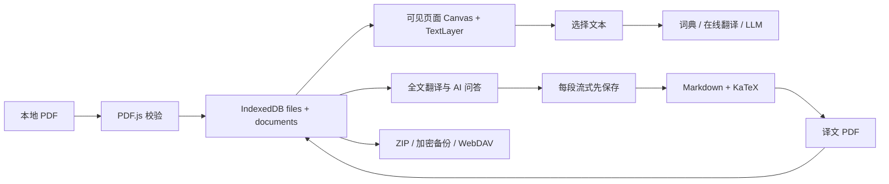

# 项目结构与开发逻辑

适用版本：0.1.0。入口为 `index.html` → `src/js/main.js`。这是静态前端工程，**没有 `main.py`，也没有 Python 运行时或后端函数**；与原需求中 main.py 对应的应用协调职责由 `App` 类承担。

## 文件树

```text
pdf_translater/
├─ .codex/pdf_translater_dev.md     用户提供的开发约束（只读）
├─ .gitignore
├─ .prettierrc.json                 新建代码的格式规则
├─ index.html                      唯一页面入口、文件输入、弹窗和提示容器
├─ package.json                    版本、依赖和 npm 命令
├─ package-lock.json               精确依赖锁定
├─ vite.config.js                  相对路径静态构建与本地开发配置
├─ playwright.config.js            Chrome/Chromium 端到端测试配置
├─ LICENSE                         项目 GPL-3.0
├─ README.md                       用户使用说明、部署和能力边界
├─ DEVELOP.md                      结构变动、开发决策、验证记录
├─ CHANGELOG.md                    版本功能及修复
├─ STRUCTURE.md                    本文档
├─ THIRD_PARTY.md                  代码、素材、API 和许可证来源
├─ src/
│  ├─ ui_rules/
│  │  ├─ UI_Design.png              用户提供的主界面参考图
│  │  ├─ ui_design_rules.md         用户提供的设计准则
│  │  └─ reference-preview.jpg      阅读原始大图用的缩小预览，不参与构建
│  ├─ _logo/
│  │  ├─ LUCIDE-LICENSE
│  │  ├─ FLUENT-LICENSE
│  │  ├─ icons/*.svg               48 个已下载 Lucide 图标，清单见下
│  │  └─ art/{open-book,sparkles}.png
│  ├─ js/
│  │  ├─ main.js                   应用协调、标签、工具栏、文档管理
│  │  ├─ storage.js                七表 IndexedDB、事务写入和合并
│  │  ├─ settings.js               多 API 兼容配置、归一化、默认服务
│  │  ├─ utils.js                  转义、UUID、下载、哈希、格式化
│  │  ├─ text.js                   PDF 排版清洗、单词判断、按字节切片
│  │  ├─ translation.js            免费词典、词形补充、MyMemory 翻译
│  │  ├─ llm.js                    Chat/Responses、文件输入、SSE、原生 PDF
│  │  ├─ markdown.js               Markdown/KaTeX/高亮/安全 HTML
│  │  ├─ pdf.js                    PDF.js 加载、文本提取、可见页和批注交互
│  │  ├─ pdf-export.js             带批注 PDF、视觉版全文译文 PDF
│  │  ├─ archive.js                ZIP、AES、校验、迁移、WebDAV
│  │  └─ ui/
│  │     ├─ components.js          图标、按钮、下拉、弹窗、提示、输入框
│  │     ├─ assistant.js           划词、全文、AI 会话与任务状态
│  │     ├─ settings-panel.js      设置四页、首次引导、迁移入口
│  │     ├─ desktop.js             桌面状态和分栏调整独立交互
│  │     └─ mobile.js              移动端分屏、视口、选择翻译自动切页
│  └─ styles/
│     ├─ base.css                  Tokens、公共组件、所有功能模块通用样式
│     ├─ pdf-text-layer.css        PDF.js 文字层必要规则及许可证来源注释
│     ├─ desktop.css               >960px 桌面横屏布局
│     └─ mobile.css                ≤960px 移动竖屏布局
├─ public/
│  ├─ fonts/{NotoSansSC-Regular.otf,LICENSE}
│  ├─ pdfjs/{cmaps,standard_fonts,wasm}/   构建前从锁定的 PDF.js 包复制
│  └─ licenses/                    构建时复制项目与素材许可证
├─ tools/
│  ├─ download-assets.ps1          下载开源图标、插画、字体与文档
│  ├─ prepare-assets.mjs           拷贝 PDF.js 资源和分发许可证
│  ├─ check.mjs                    递归进行 JavaScript 语法检查
│  └─ verify-dist.mjs              生产子路径静态部署、无 CDN、中文导出检查
├─ tests/
│  ├─ core.test.mjs                数据、清洗、SSE 和存档协议测试
│  └─ e2e/app.spec.js              合成 PDF 的真实浏览器功能回归
├─ dist/                           构建产物，不手工编辑
├─ node_modules/                   npm 依赖，不手工编辑
├─ .cache/                         npm 缓存、开发期官方文档，不进入发布
└─ test-results/                   测试截图、失败 trace，不属于用户数据
```

图标文件名（均为 `.svg`）：`arrow-left`、`arrow-up-right`、`book-open`、`bot`、`check`、`chevron-down`、`chevron-left`、`chevron-right`、`circle-alert`、`circle-help`、`cloud`、`copy`、`database`、`download`、`eraser`、`expand`、`external-link`、`eye`、`file-text`、`folder-open`、`highlighter`、`history`、`key-round`、`languages`、`loader-circle`、`menu`、`message-square`、`minus`、`monitor`、`panel-left-close`、`pencil`、`plus`、`redo-2`、`refresh-cw`、`search`、`send`、`settings-2`、`shield-check`、`smartphone`、`sparkles`、`stop-circle`、`trash-2`、`type`、`underline`、`undo-2`、`upload`、`volume-2`、`x`。

`public/pdfjs` 内的文件清单由 `node_modules/pdfjs-dist/{cmaps,standard_fonts,wasm}` 与 package-lock 唯一决定，属于供应商静态数据而非应用模块；构建无 CDN 依赖。

## 数据模型与不变量

数据库名 `paper-bridge`，版本 1；所有对象仓库以 `id` 为 keyPath。

| 表 | 核心字段 | 用途 / 不变量 |
| --- | --- | --- |
| documents | id, rootId, name, pages, size, page, zoom, createdAt, updatedAt, translationId? | 标签、管理栏、阅读进度；原文 rootId=id，译文指向原文根 ID |
| files | id, blob, updatedAt | id 与 documents 一致；原始或生成 PDF 不可变，避免编辑破坏源文件 |
| annotations | id, documentId, page, type, color, rects/points/x/y/text, deleted, recovered? | 对特定 PDF 的归一化坐标；删除使用 tombstone，支持同步与撤销 |
| conversations | id, rootId, title, createdAt, updatedAt | 逻辑文档下多条独立会话；原文和译文共享 |
| messages | id, conversationId, role, content, status, error?, createdAt, updatedAt, recovered? | 用户先保存再请求；助手逐增量保存；不按轮数裁剪 |
| translations | id, documentId, rootId, content, language, providerId, status, error?, output, generatedDocumentId? | 多次全文翻译记录及 PDF 产物关联 |
| settings | id, value, updatedAt | `app` 存 API、翻译和 WebDAV；`workspace` 存标签、活动文档和各文档活动对话 |

`status` 常见值：`streaming`、`complete`、`stopped`、`error`；从旧会话恢复的未完成 streaming 内容如实显示未完成，不在启动时批量篡改状态（避免影响另一个仍活动的窗口）。

所有恢复冲突副本 ID 为 `原ID-recovery-更新时间`，相同旧版本只保留一次。批注副本也保留在数据库和页面，可通过撤销/编辑处理，不会丢掉已有内容。文件 Blob 不随 metadata 合并被覆盖。

## 内部模块 API / 函数

### storage.js

- `database()`：懒打开数据库，只在 upgrade 创建缺失结构；升级被其他窗口阻挡时发出事件。
- `all(store)`、`get(store,id)`：读取记录。
- `put(store,row)`：克隆对象、设置更新时间并等待事务提交。
- `patch(store,id,values)`：在同一事务里读取再合并，避免覆盖无关字段。
- `addDocument(blob,name,pages,rootId?)`：文档 metadata 和文件 Blob 在同一事务写入。
- `snapshot()`：单个只读事务得到所有表的一致快照。
- `mergeSnapshot(data,{restoreSettings})`：跨表原子合并，保留冲突内容；可选合并设置/API；错误回滚。
- `requestPersistence()`：请求浏览器持久存储，返回实际授权结果，不承诺浏览器不会被主动清空。

### settings.js

- `PROVIDERS`：首次引导用服务商模板。OpenAI 和 MiMo 模型名称由用户填写。
- `normalizeSettings(raw)`：兼容海姆休息室单 API 和多 API 格式；规范化 URL、去重 provider ID、同步默认三字段。
- `getSettings()`、`reloadSettings()`：读取/重载配置缓存。
- `saveSettings(next)`：先提交存储再更新缓存和派发 `settings-changed`。
- `getProvider(settings,id?)`：选择 API，缺少地址或模型时给出明确错误。

### text.js / translation.js

- `cleanPdfText(input)`：检测连续行号、修复断行连字、过滤数字引用、合并空白；保留公式上标与年份。
- `isSingleWord(text)`：英文单词（可含连字或撇号）走词典，其余走句子翻译。
- `splitForTranslation(text,byteLimit=450)`：按 Unicode 码点切片，以 UTF-8 字节限制请求，不破坏代理对。
- `CLEANING_INSTRUCTIONS`：统一 LLM 排版修复和文档内指令隔离提示。
- `onlineTranslate(text,source,target,signal)`：按段请求 MyMemory，验证服务状态/额度，支持超时和取消。
- `lookupWord(word,signal)`：Free Dictionary 主查询；并行补充 MyMemory 中文、Wiktionary 英文词形；只提取安全文本，不查询 LLM。
- `LANGUAGES`：中简/中繁/英/日/韩/法/德/西的展示和 API 代码映射。

### llm.js

- `headers(provider)`：按服务组装 JSON 与 Key 头，兼容 MiMo `api-key`。
- `sseEvents(body)`：流式 UTF-8 解码；支持分块 CRLF、多行 data、尾包，释放 reader 锁。
- `extractText(json)`：Chat 与 Responses 非流式文本统一提取。
- `requestLlm(options)`：构造协议请求，可附整份 PDF；处理 Markdown 增量、完成标记、错误、截断与原生 PDF 容器文件。`onDelta` 是异步回调，必须 await 持久化。
- `testProvider(provider,signal)`：短文本响应测试，不设置可能破坏结构的输出截断。
- `listModels(provider)`：读取 `/models`，超时后报告错误。

### markdown.js / pdf-export.js

- `renderMarkdown(text)`：Markdown + KaTeX + 代码高亮后 DOMPurify 清理，允许所需的安全字体、颜色、表格样式。
- `mountMarkdown(element,text)`：将安全内容放入容器，链接隔离打开；远程图片改占位，避免隐式请求。
- `loadFont()`（内部）：第一次含文本的批注导出加载 Noto 字体。
- `exportAnnotatedPdf(blob,annotations,sourcePdf)`：读取原 PDF，按 viewport 转换归一化坐标，绘制高亮、下划线、笔迹及中英文字；保持原文件不变。
- `markdownToPdf(text,onProgress)`：离屏渲染译文，逐块/逐页生成 PDF；过高块分片，逐页释放画布。输出为栅格视觉 PDF。

### pdf.js

- `loadPdf(blob,onPassword)`：传入本地二进制及本地 CMap/字体/WASM；密码通过回调获取；为 PDF.js 6 的 loading task 提供统一 destroy 适配。
- `extractPdfText(pdf,onProgress)`：顺序获取每页文字，按位置移除页边纯数字行号，附页码。
- `PdfViewer.constructor`：绑定桌面 pointerup 和手机 selectionchange 延迟处理。
- `open(doc,pdf)`：取消旧渲染、切换文档和批注。
- `layout()`：计算比例、建立页面占位、观察可见页、记录滚动页码。
- `renderPage(number,generation)`：只渲染临近可见页，建立画布/文字层/批注层/手绘层，防止旧文档异步回填；单页画布上限 600 万像素。
- `goTo(page)`、`setZoom(zoom)`：页码边界、滚动和重新布局。
- `setTool(tool,color)`：切换鼠标命中层；选择工具时保留文字选择。
- `captureSelection()`：裁切真实 Range 与每个文字 span 的交集，转换归一化坐标，避免跨页容器误入高亮；高亮/下划线直接记录，其余交给翻译。
- `annotateSelection(type,color)`：按页面拆分选区批注。
- `addAnnotation(value)`：先保存后绘制，记录当前文档撤销栈。
- `undo(redo)`：更新 tombstone，跨文档维护独立撤销栈；该栈仅本次应用会话有效。
- `editAnnotation(annotation)`：文本或便签的编辑/删除回调。
- `drawAnnotations(page)`：从持久化状态重绘 DOM 与手绘 Canvas。
- `bindInk(canvas,page)`：pointer capture 手绘；橡皮擦命中笔迹；点击创建便签或文本框。
- `find(query)`：从当前页循环查找文本并跳转，扫描件无文字层则不会匹配。

### archive.js

- `createArchive({includeSecrets,password})`：一致快照、二进制 PDF、SHA-256 清单、异步 ZIP；可剥除凭据和加密。
- `keyFor`、`encrypt`、`decrypt`（内部）：PBKDF2-SHA256 250000 次，AES-256-GCM；magic `PBRIDGE1` + 16 字节 salt + 12 字节 IV + 密文。
- `readArchive(blob,password)`：解密、限制解压内存、检查格式版本、ID、安全字段、跨表引用、文件哈希和 PDF 头。
- `importArchive(blob,options)`：验证后事务合并；可恢复设置并刷新缓存。
- `importFritiaSettings(file)`：从 JSON 或原项目 ZIP 中查找旧设置字段，合并 provider，不修改来源文件。
- `auth`、`remoteUrl`、`dav`（内部）：UTF-8 Basic Auth、安全 HTTP(S) 路径与超时请求。
- `testWebDav(config)`：PROPFIND 检查实际浏览器跨域请求。
- `syncWebDav(onStatus)`：禁止重入；GET+校验+本地合并+条件 PUT；不暴露凭据到云端，无强 ETag 时拒绝覆盖已有数据。
- `scheduleSync(onStatus,onError)`：按保存的启用状态设置 30 分钟定时器（最小间隔 5 分钟）。

### utils.js

`uid` 创建 UUID；`esc` 转义 HTML；`sizeLabel`、`dateLabel` 格式化展示；`download` 创建下载链接并延迟释放 Blob URL；`saveFile` 优先原生保存位置选择器，退回浏览器下载；`sha256` 算文件摘要；`bytesToBase64` 分块编码；`safeUrl` 只允许 HTTP(S) 且拒绝 URL 中嵌凭据；`errorMessage` 转换取消/网络/接口异常。

### ui/components.js

`icon` / `illustration` 读取构建时导入的本地图标/插画；`button` / `iconButton` 生成有 aria-label 的按钮；`select` / `selected` / `bindSelects` 实现自绘下拉与键盘选择；`closeMenus` 统一关闭；`toast` 展示临时状态；`modal` 管理焦点环、Esc 和遮罩；`inputDialog` 返回可等待的文本、密码、取消或删除操作。

### ui/settings-panel.js

- `openSettings(app,tab)`：API、备份、WebDAV、帮助四视图；API 草稿只在保存后持久化；测试不覆盖设置。
- `onboarding(app)`：首次欢迎→选择服务→填地址/Key/模型→测试→保存；也可先使用免费翻译。

### ui/assistant.js 的 Assistant

- `constructor` / `render`：绑定右栏标签，按渲染 epoch 防止旧异步视图覆盖新视图。
- `renderSelection` / `translateSelection`：内存缓存按文档分组；新选区取消旧请求；单词与句子严格分流。
- `settings`：引擎、源/目标语言、学术风格浮层。
- `renderFull` / `startFull`：全文参数、历史、按文档分组的独立任务、流式落盘和阶段反馈。
- `exportTranslation`：复用或新建译文 PDF；写入关联根 ID；打开或下载。
- `renderChat` / `appendMessage`：按 rootId / conversationId 加载消息，显示部分结果和恢复副本。
- `createThread`：创建独立会话并保存当前会话选择。
- `sendMessage`：先保存提问与回复占位，再组织完整文档及全部历史；每段流式先 patch，再更新当前匹配面板。
- `needsDocument`、`copy`、`speak`：空态、剪贴板、系统语音朗读辅助。

### main.js 的 App（主入口职责）

| 方法 | 功能 |
| --- | --- |
| constructor / init | 初始化状态、数据库、界面、持久存储请求、恢复标签/对话和首次引导 |
| mount / bind / action | 生成静态界面骨架、委托动作、导入拖放、快捷键、尺寸变化 |
| importFiles | 逐份校验加载 PDF，事务保存后打开；失败不产生半成品 |
| importGenerated | 验证生成的 PDF，保存为共享原文 rootId 的新文档 |
| openDocument / closeDocument | 处理并发打开序号、资源释放、历史切换；关闭只移除标签 |
| saveWorkspace | 保存标签、活动 PDF 和每个文档活动对话 |
| renderTabs / renderToolbar / toolButton | 文件卡片、指定顺序的工具条、颜色和激活反馈 |
| setTool / colorPicker | 工具模式、选区快速标注、自绘颜色浮层 |
| changeZoom / setPage | 比例、跳页和延迟保存滚动位置 |
| showReader / showSecondary | 工作区与管理页之间切换 |
| showLibrary / showRecords | PDF 库搜索、重命名、原文件下载、全文翻译历史 |
| documentText | 顺序提取全文，缓存最近一份文本并释放临时 PDF Worker |
| downloadCurrent | 原文件直接下载或加载导出模块写入批注 |
| reload / refreshAssistant | 导入、设置、云同步后的界面刷新 |
| updateSaved / setSyncStatus | 持久化提交及同步状态展示 |

### 独立布局交互

`initDesktopLayout()` 只在桌面启用分隔条 pointer/键盘交互，更新 `--reader-share`。

`initMobileLayout()` 只管理移动视口高度、分屏状态和划词后切到翻译；`setMobilePane(pane)` 切换阅读/助手，同时退出管理页，不改桌面列宽。

## DOM 页面功能映射

| DOM / 标识 | 用户功能 | 处理模块 |
| --- | --- | --- |
| #app / .sidebar / .main-nav | 品牌、PDF 阅读、文档、翻译记录、设置/同步入口 | App.mount / action |
| #workspace / .reader-panel / .assistant-panel | 左 PDF 右翻译的工作区 | desktop/mobile |
| #split-handle | 拖动或方向键调整左右宽度 | desktop.js |
| #document-tabs / .document-tab | 已打开 PDF 卡片、页码、关闭和激活 | App.renderTabs |
| #pdf-input | 隐藏本地多文件选择器 | App.importFiles |
| #pdf-toolbar / [data-select=zoom] / #page-input | 阅读缩放、导航、编辑工具、颜色指示和导出 | App.renderToolbar |
| #pdf-scroll / .pdf-page | 滚动阅读、页面占位与画布 | PdfViewer |
| .textLayer / .annotations / .ink-layer | 真正可选文字、标注和手绘命中层 | PdfViewer |
| #reader-empty | 空态导入与拖放提示 | App |
| #document-status / #save-status | 页数、大小、本地提交状态 | App |
| [data-assistant-tab] | 划词 / 全文 / AI 问答切换 | Assistant |
| #translation-settings | 翻译引擎和风格设置浮层 | Assistant.settings |
| #selection-result | 在线词典或句子结果，不持久化 | Assistant.renderSelection |
| #full-stage / #full-result | 全文状态和完整 Markdown 结果 | Assistant.startFull |
| [data-select=translation-history] | 当前 PDF 的旧译文选择 | Assistant.renderFull |
| [data-select=chat-thread] / #chat-messages | 当前根文档的会话与全部消息 | Assistant.renderChat |
| #chat-form / #chat-input | 问题输入、API 选择、发送和停止 | Assistant.sendMessage |
| #library-view / #library-search / #document-grid | 文档网格和名称筛选 | App.showLibrary |
| .record-list / [data-record] | 打开对应 PDF 的全文历史 | App.showRecords |
| #overlay-root / .modal | 通用焦点受控弹窗、设置、密码和批注输入 | components |
| #settings-content / #provider-form | 多 API 配置及能力设置 | settings-panel |
| #cloud-form | WebDAV 账号、测试、同步和开关 | settings-panel / archive |
| #archive-input | 本地 ZIP / 加密存档选择 | settings-panel / archive |
| #onboarding-content / #onboarding-form | 首次引导步骤 | onboarding |
| #color-popover | 工具独立的浅色/常规颜色选项 | App.colorPicker |
| .mobile-nav / [data-mobile-pane] | 手机阅读、翻译、文档与设置单页导航 | mobile.js |
| #toast-root | 保存、失败、导入等实时反馈 | toast |

## 核心数据流



模型返回内容不是可信 UI；必须通过统一 Markdown 清理函数。文件名、对话名和词典结果必须 HTML 转义。导入记录先验证；所有图片/图标从本地打包资产加载。未来改动不能引入清库迁移或未等待提交的“已保存”提示。
